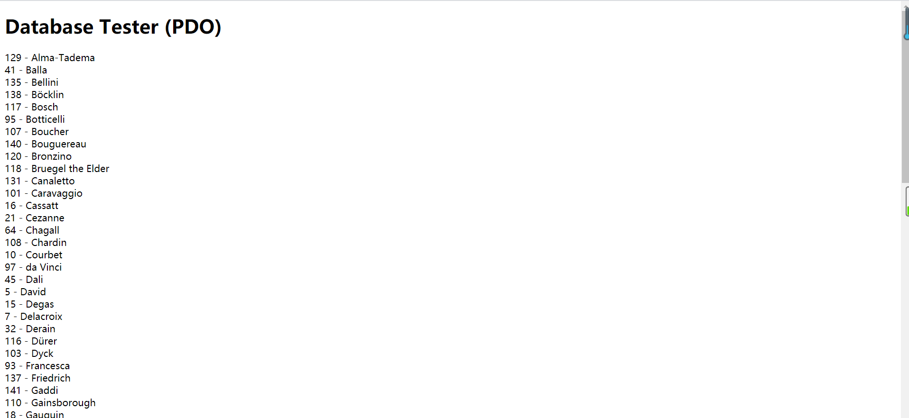
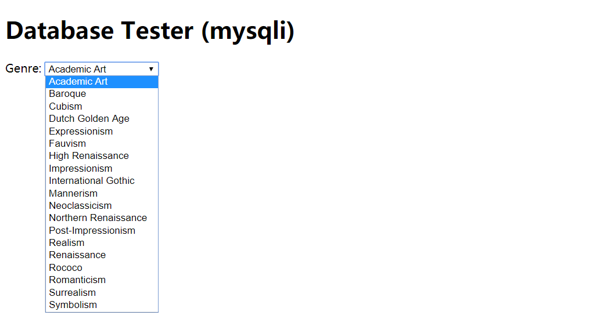
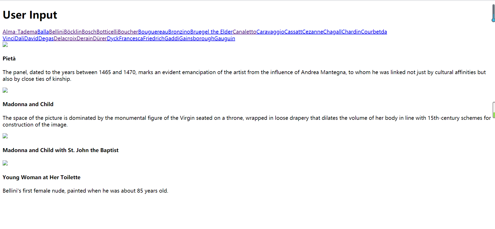

## Github address:
<https://github.com/jack0910/SOFT130002_lab>

##Screenshots:

##Answer:
1.exercise7-pdo: _pdo作为php5的新功能，能做到便捷地访问任何的数据库。
这种方式先是new一个PDO对象，然后通过setAttribute函数访问到mysql数据库（对象属性值是凭证）,
再给sql变量赋值sql查询语句，接着调用PDO对象的传了sql变量的query函数，
并把查询结果赋给了result变量，最后用while语句遍历查询结果并输出。_

2.exercise7-mysqli: _这种方式只适用于mysql数据库。它用mysqli_connect对象做连接，过程与PDO方式相似，只是需要关闭连接。_

3.exercise8: _（1）main标签创建两个块，第一个块引入php中outputArtists()函数用于输出查询到的艺术家名字。
第二个块用于引入php中outputPaintings()函数用于输出查询到的对应艺术家的艺术品详情。_

_（2）outputPaintings(),outputSinglePainting($row)函数联合使用。
outputPaintings()根据从outputArtists()函数得到的艺术家名字进一步sql查询并展示。
而展示部分由outputSinglePainting($row)函数负责，outputSinglePainting($row)函数直接往html中输出块来展示艺术品详情。_

4.使用executeUpdate或者使用executeLargeUpdate方法来执行SQL语句中的DDL和DML语句。

使用execute方法执行SQL语句。

使用PreparedStatement，Statement执行SQL语句。
>1.PreparedStatement预编译SQL语句，性能更好。                                                                   
>2.PreparedStatement无须“拼接”SQL语句，编程更简单。                                                                    
>3.PreparedStatement可以放置SQL注入，安全性更好。

使用CallableStatement执行SQL语句以调用存储过程。